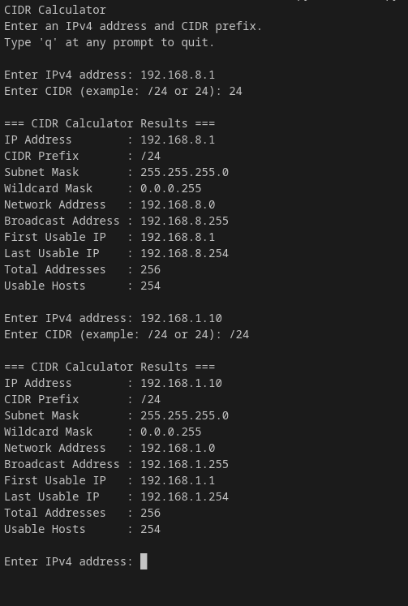

# CIDR Calculator

A Python command-line tool for calculating IPv4 subnet information from an IP address and CIDR prefix.

This project was built to strengthen both Python development skills and core networking fundamentals by turning subnet calculations into a clean, testable CLI utility.

## Why I Built This

As someone working in networking and growing into software engineering, I wanted a project that sat at the intersection of both disciplines.

This tool takes a common network engineering task—working with CIDR notation and subnet boundaries—and packages it into a reusable command-line application with testable core logic.

## Features

- Convert CIDR prefix to subnet mask
- Calculate wildcard mask
- Determine network address
- Determine broadcast address
- Calculate first and last usable host addresses
- Calculate total addresses and usable hosts
- Handle `/31` and `/32` edge cases
- Run as an interactive CLI
- Keep subnet calculation logic separated from the interface
- Include automated unit tests for core functionality

## Tech Stack

- Python 3
- Standard Library
  - `dataclasses`
  - `unittest`

## Project Structure

```text
cidr-calculator/
├── app/
│   ├── calculator.py      # Core subnet calculation logic
│   └── cli.py             # Command-line interface
├── tests/
│   └── test_calculator.py # Unit tests
├── main.py                # Application entry point
├── README.md
└── requirements.txt
```

## Getting Started

### Clone the Repository
```bash
git clone https://github.com/KDubyaFisher/cidr-calculator.git
cd cidr-calculator
```
### Run the Application
```bash
python3 main.py
```

### Example Usage
```bash
Enter an IPv4 address: 192.168.1.10
Enter CIDR (example: /24 or 24): /24
```
### Example Output
```text
=== CIDR Calculator Results ===
IP Address:         192.168.1.10
CIDR Prefix:        /24
Subnet Mask:        255.255.255.0
Wildcard Mask:      0.0.0.255
Network Address:    192.168.1.0
Broadcast Address:  192.168.1.255
First Usable IP:    192.168.1.1
Last Usable IP:     192.168.1.254
Total Addresses:    256
Usable Hosts:       254
```
### Running Tests
```bash
python3 -m unittest discover tests
```

## What This Project Demonstrates

- Python program structure and separation of concerns
- Input validation and edge-case handling
- CLI application design
- Writing and organizing unit tests
- Applying software development practices to networking problems

## Roadmap

Planned improvements include:

- Command-line flags for non-interactive use
- JSON output for scripting and automation
- CSV export support
- IPv6 support
- Installable package support
- GitHub Actions for automated test runs
- Subnetting practice mode for learning

## Screenshot



## Author

**Kolton Fisher**

*Focused on building practical projects that connect networking knowledge with software engineering skills.*

